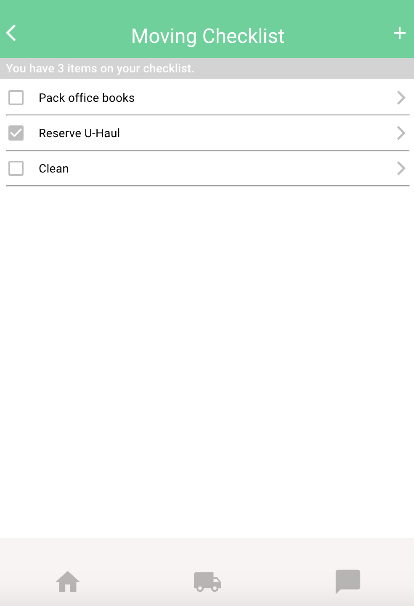

<h1 align="center">:articulated_lorry: Packing To Do List</h1>  

<b>React App for Tracking Moving Tasks</b>

<em>3 January 2020</em>

By Vanessa Stewart

## :world_map: Description
This is a little project that I made to practice using Material UI and React's useContext hook to store state and provide state to only functional components that need it. Users can read, add, update, and delete items from a moving to do list.

## :clipboard: Setup/Installation Requirements
* Navigate to the directory in which you would like to clone this project.
* Run `git clone https://github.com/vanmars/moving-list.git` in terminal.
* Run `cd moving-list` to navigate into new project directory.
* Open the cloned repo in a text editor of your choice.
* Run `npm install` to download all dependencies.
* Run `npm start` to start a live server and view projec in the browser.

## :beetle: Known Bugs
_There are no known bugs at this time. But the following item could be improved:_

## :envelope: Support and Contact Details

_Connect with me at vamariestewart@gmail.com with ideas to improve this project._

## :gear: Technologies Used

* React with Hooks: useContext, useState, useEffect
* Material-UI
